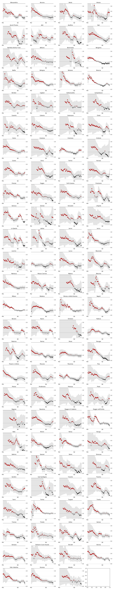
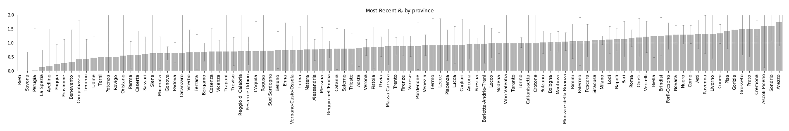

# Realtime Rt estimates in Italy

This repo contains Rt estimates per province in Italy using Kevin Systrom's Jupyter notebook that was published [here](http://systrom.com/blog/the-metric-we-need-to-manage-covid-19/). The [official data](https://github.com/pcm-dpc/COVID-19) from Protezione civile was used.

### 14 april 2020

